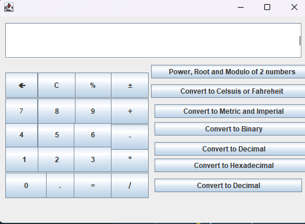
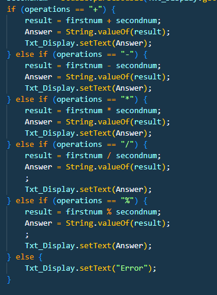
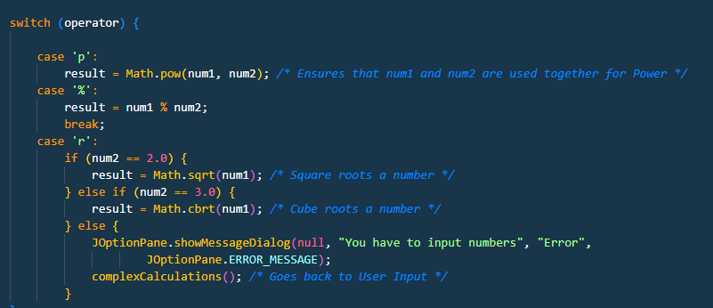

# Calculator

# Java Calculator Program with UI

User interface of the calculator

Used Java.swing to create the user interface

The numbers and operations are classed as buttons to receive user Input

The exit fuction must be called to close the calculator without any errors in exceptions

# 8 Tasks

# 1. Addition, subtraction, multiplication, and division of two numbers

    This is operated by the user interface
    

# 2. Power, modulo, and square/cube roots

    Math Functions via Java.Math
    

    Switch case conditional Statement

# 3. Conversions between temperature units (Celsius/Fahrenheit)

    The formula for converting Fahrenheit to Celsius is C = 5/9(F-32).
    The Formula of Celsuis to Fahrenheit is: °F = (°C × 9/5) + 32

# 4. Conversions between Metric and Imperial units for mass (g/oz) and length (cm/inches)

    oz = g * 0.035274
    g = oz / 0.035274

    Inches = Centimeters / 2.54
    Centimeters = Inches * 2.54

# 5. Conversion of a decimal number to binary

    Divide this number by 2 until the remainder is 0 or 1.

# 6. Conversion of a binary number to decimal

    Step 1: Write down (1010)2 and determine the positions, namely the powers of 2 that the digit belongs to.
    Step 2: Represent the number in terms of its positions. (1 * 23) + (0 * 22) + (1 * 21) + (0 * 20)
    Step 3: (1 * 8) + (0 * 4) + (1 * 2) + (0 * 1) = 8 + 0 + 2 + 0 = 10
    Therefore, (1010)2 = (10)10

# 7. Conversion of a decimal number to hexadecimal

    Step 1: First, divide 960 by 16.
    960 ÷ 16 = 60 and remainder = 0

    Step 2: Again, divide quotient 60 by 16.
    60 ÷ 16 = 3 and remainder 12.

    Step 3: Again dividing 3 by 16, will leave quotient=0 and remainder = 3.

    Step 4: Now taking the remainder in reverse order and substituting the equivalent hexadecimal value for them, we get 3→3, 12→C and 0→0
    Therefore, (960)10 = (3C0)16

# 8. Conversion of a hexadecimal number to decimal

    Step 1: Write the decimal equivalent of each digit of the number in hexadecimal form (from the above table)
    Step 2: Multiply the digits from right to left with exponents of 160, 161, 162, ... in order starting from the right most digit.
    Step 3: Then add all the products. The resultant sum is the number in the decimal system.
