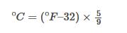
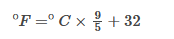
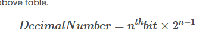

# Calculator

## Overview
**Calculator** is a Java-based desktop application built using **Swing** that provides both standard arithmetic functionality and advanced conversion utilities. The project demonstrates GUI development, event-driven programming, and modular design through separation of calculation logic.

This application goes beyond a basic calculator by supporting multiple numerical systems and unit conversions, making it a strong showcase of practical Java skills.

## Features

### Core Calculator Functions
- Addition, subtraction, multiplication, and division
- Modulo operation
- Decimal input support
- Positive/negative toggle
- Backspace and clear functionality

### Advanced Calculations & Conversions
- Power, root, and modulo calculations
- Temperature conversions (Celsius ↔ Fahrenheit)
- Metric and Imperial mass conversions
- Decimal ↔ Binary conversion
- Decimal ↔ Hexadecimal conversion

### User Interface
- Desktop GUI built with Java Swing
- Right-aligned display for improved readability
- Button-driven, event-based interaction

## Tech Stack
- **Language:** Java  
- **GUI Framework:** Java Swing (AWT)  
- **Architecture:** Event-driven programming  
- **Build Tool:** Standard Java compilation  

## Installation

### Prerequisites
- Java JDK 8 or higher

## Setup & Run
### Clone the repository:
   `git clone`
### Compile the project:
`javac com/calculator/run.java`
### Run the application:
`java com.calculator.run`

# How It Works
User input is captured through Swing ActionListeners
Numeric values are stored and processed using double precision
Operations are executed using a switch-based control structure
Advanced calculations are delegated to a separate calculations class
Results are dynamically rendered in the GUI display

# Error Handling & Limitations
Division by zero is not explicitly handled (can be improved)
Input is assumed to be numeric
UI resizing is currently disabled

# Future Improvements
Enhanced input validation
Keyboard input support
Improved exception handling
UI layout management (GridLayout)
Unit test coverage
Scientific calculator functions

# Why This Project
This project demonstrates:
Strong understanding of Java Swing and GUI design
Event-driven application architecture
Modular code organization
Real-world problem solving beyond basic examples

# Screenshots of UI

# 1. Addition, subtraction, multiplication, and division of two numbers

# 2. Power, modulo, and square/cube roots

# 3. Conversions between temperature units (Celsius/Fahrenheit)

# 4. Conversions between Metric and Imperial units for mass (g/oz) and length (cm/inches)
    - oz = g * 0.035274
    - g = oz / 0.035274
    - Inches = Centimeters / 2.54
    - Centimeters = Inches * 2.54
# 5. Conversion of a decimal number to binary

# 6. Conversion of a binary number to decimal
- Step 1: Write down (1010)2 and determine the positions, namely the powers of 2 that the digit belongs to.
- Step 2: Represent the number in terms of its positions. (1 * 23) + (0 * 22) + (1 * 21) + (0 * 20)
- Step 3: (1 * 8) + (0 * 4) + (1 * 2) + (0 * 1) = 8 + 0 + 2 + 0 = 10
# 7. Conversion of a decimal number to hexadecimal

# 8. Conversion of a hexadecimal number to decimal

